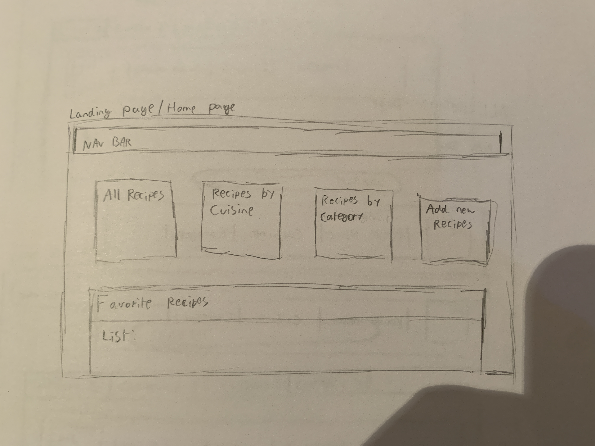
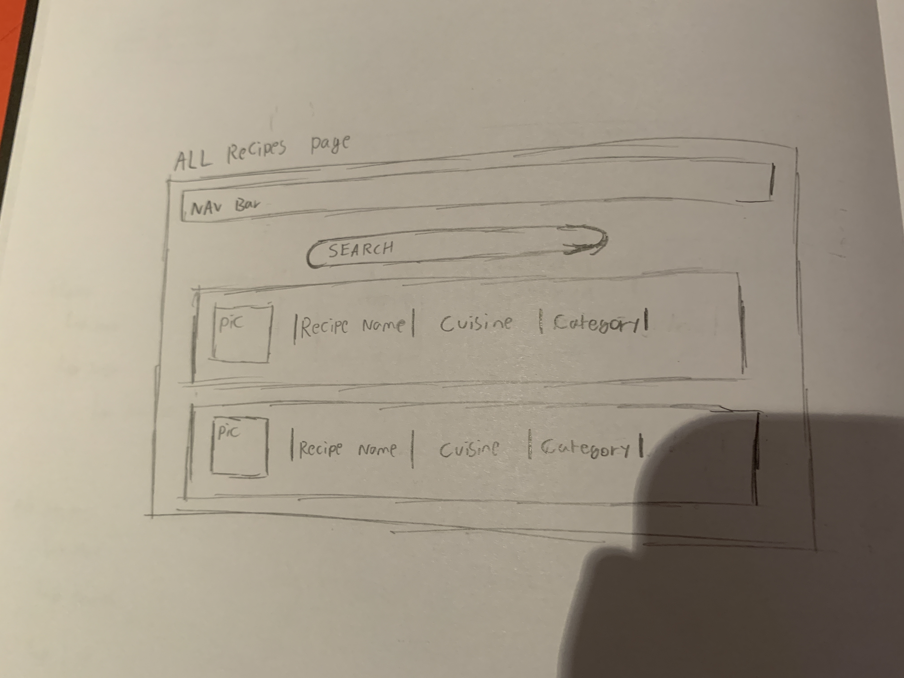
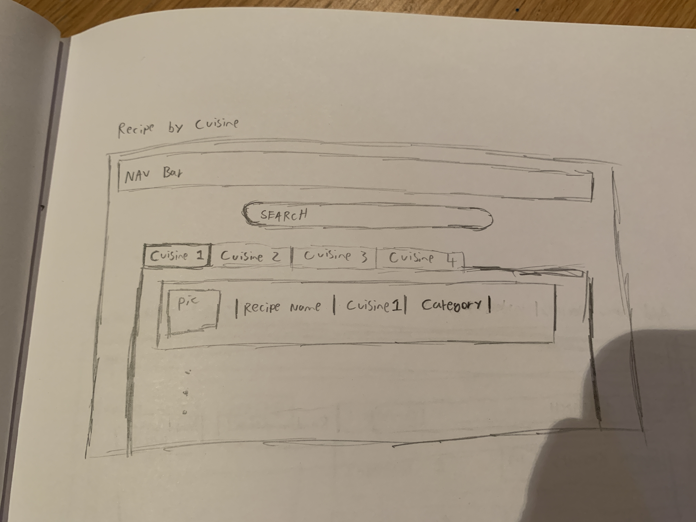
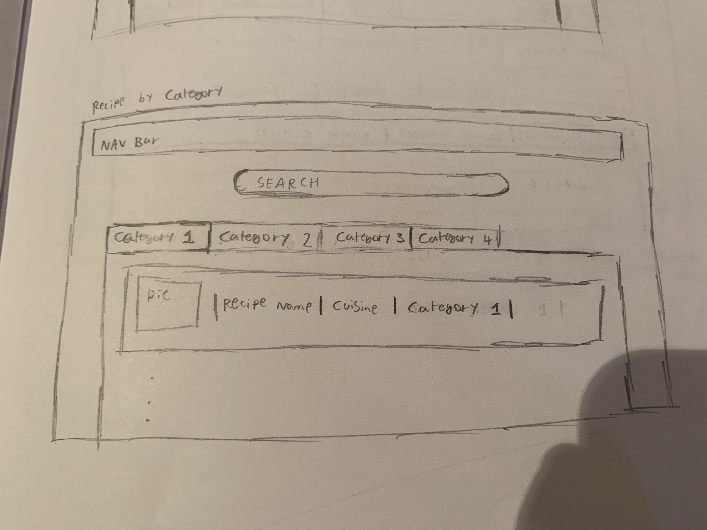
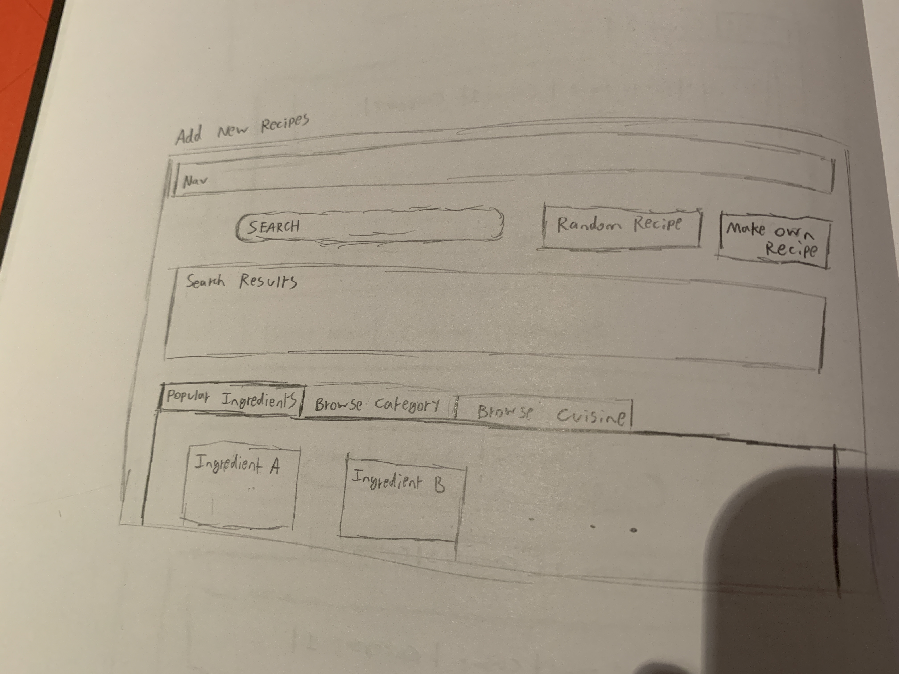
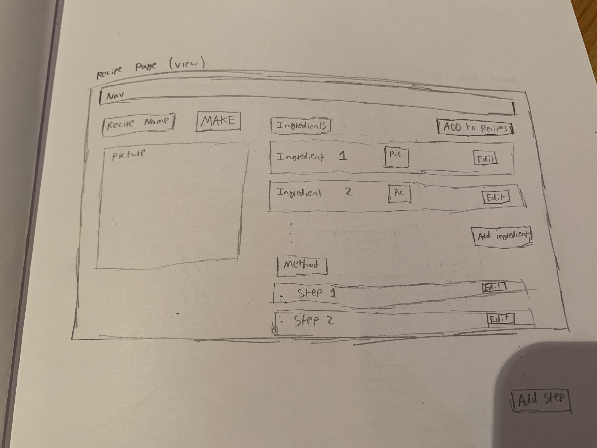
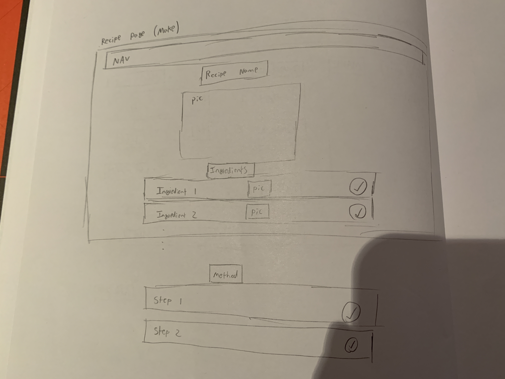

# Tic Tac Toe - Stranger Things Edition

## Purpose:

The purpose of this project was to reinforce my learnings in the first 5 weeks of the GA SEI course so far. I wanted to make sure that my understanding of the concepts taught up to this point are solid as they will form the foundations of the more complex concepts later in the course. As this is also my second proper 'project', I wanted to build upon the learnings from my previous project and try and avoid some of the teething issues.

The technologies used were:

- JavaScript
- CSS
- ReactJS
- APIs

## Deployment Link:

The project has been deployed on GitHub Pages. There are no specific requirements in order to access the project. There is also no requirement for any getting started or code installation.

The link can be accessed here - https://cootsy99.github.io/react-recipes/

## Timeframe & Working Team

I was given a timeline of 4 working days plus the weekend prior to complete this project and it was a solo endeavor.

## Brief

### High Level

- Build a front-end list based React application that updates the UI and makes requests to the API.
- Include data from a third-party API.

### General

- Build a web application from scratch, without a starter codebase. Must be your own work.
- Use React with `create-react-app` to build your application.
- Plan your application using wireframes and user stories.
- Craft a README.md file that explains your app to the world.
- Deploy your app online, where the rest of the world can access it.

### Technical Requirements

Select a Project Idea of your own. But the user must be able to:

- Add a new item to a list
- Mark the item as complete/favorite/(watch, read, listen) later/flag/etc
- Edit an item from a list
- Remove an item from a list
- Clear/delete all items
- Clear/delete only marked items
- Fetch data from at least one 3rd party API using Axios or fetch.
- Make frequent Git commits with descriptive messages, explaining your commit.
- Use React Router to handle multiple pages/views.

### Deployment

- Your React app must be deployed to GitHub Pages, Surge, or any hosting service. Applications that are not deployed will be considered incomplete.

### Potential Additional Features

- Use of another 3rd Party API
- Clean up props: Use `React.Context` to pass props down to your children
- Make the app Responsive
- Save the data to localStorage or an API
- Use 1 or more 3rd party libraries
- Use a React component library like Ant Design, Bootstrap React, or Material UI
- Use a CSS library like Bootstrap
- Add User Sign Up, Sign In, and Sign Out with Firebase and React Authentication (can be very challenging)

### User Stories

- AAU I want to be able to see all my recipes in alphabetical order so that I can easily navigate to the recipe I want.

- AAU I want my recipes to be categorised by cuisine type, e.g. Italian, Indian, Chinese etc. so that I can easily pick out recipes of a certain cuisine type.

- AAU I want my recipes to be categorised by popular ingredients, e.g. chicken, fish, noodles so that I can pick out recipes that suit the ingredients I have in the house. E.g. if I have chicken in the fridge, it would be helpful to see all the recipes that include chicken.

- AAU I want to be able to add new recipes from an online recipe book (recipe API) so that I can build up my own recipe bank with recipes that I like/want to try out.

- AAU I want to be able to randomly generate a recipe from an online recipe book so that I can get inspiration for what to cook when I can't decide what I want to eat.

- AAU I want to be able to randomly generate a recipe from my recipe bank so that I can get inspiration for what to cook (from dishes I know I like), when I can't decide what I want to eat.

- AAU I want to be able to search for specific dishes and get the recipe for them, both within my recipe bank and an online recipe book so that I can quickly find the recipe I am looking for.

- AAU I want to have a list of ingredients and quantities for my recipe so I know exactly how much of each ingredient I need to make that meal.

- AAU I want to see a step by step guide of how to cook the meal so that it is really clear and simple to cook the meal.

- AAU I want to be able to be able to add / remove ingredients from a recipe so that I can add my own twist to a recipe.
- AAU I want to be able to edit the quantities of ingredients for a recipe so that I can add my own twist to a recipe.

- AAU I want to be able to add / remove method steps from a recipe so that I can make the method clearer and/or simpler.

- AAU I want to be able to edit method steps from a recipe so that I can make the method clearer and/or simpler.

- AAU I want to be able to add notes to a recipe so that if there's some info I want to remember, like how many it feeds or certain tweaks that can be made to have different variations, I can do it.

- AAU I want to be able to favorite a recipe so that I can see all of my favorite recipes in one place

- AAU I want to be able to create recipes from scratch, so that I don't have to rely on the online recipe book (API) for my recipes

- AAU I want popular recipes to exist in my recipe book by default so that I have some recipes at the start.

## Planning

### Initial Thought Process

To plan this project, I first spent some time thinking about what kinds of applications I could build given the to-do list style technical requirements. Some ideas included a playlist maker, a movie watch list and a more typical to-do list. However, for me these ideas were either not very interesting or were going to require some serious force to get the requirements in, such as the 'a user should be able to edit items in a list' requirement. In a playlist for example, editing the songs in your playlist is not a sensible idea. Whilst I'm sure there are creative getarounds to this problem I was inevitably led to the idea of building an online recipe book.

Recipe books have multiple lists - the list of recipes, the list of ingredients and the list of method steps. It seems natural that a user would want to add/delete/edit steps in either the method or the ingredients list for a recipe. Hence from the perspective of meeting the technical requirements, a recipe book lent itself quite well. The other thing that attracted me to the idea of a recipe book was that you can add complexity quite easily. Whilst I wanted to keep the project simple in the first instance in order to meet the project specifications, the recipe book is something which I can build on in the future quite easily.

### API

Obviously a big component of this project is using a 3rd party API. I needed to ensure that if the recipe book idea was going to fly that there existed a sensible API to use.

### Wireframing

Once the decision of what the application should be was made, the next step was to build some wireframes. See below

<p align="center">








</p>

### Approach

In my previous project I had taken a rather modular approach in that I dove straight into meeting the technical requirements one by one. This was not a bad approach at the time as the desired output was relatively straightforward.

For this project however, meeting the technical requirements alone would not result in a great output. The way I viewed it, the technical requirements were a small part of a bigger application. There should be a big focus on making sure the overall feel and functionality of the app was good for the user and then also ensure that I was meeting the technical requirements along the way.

The focus would therefore be to set up the application itself initially to make sure that the user can navigate through it in a seemless way. The foucs would then turn to fleshing out the components with the rough content they would have and adding psuedocode where appropriate. Then I had planned to turn my attention to the technical requirements and make sure I was adding them in a sensible way. To finish off would come the styling.

## Build Process

### Weekend

The weekend was where most of the thinking about what the app would be happened as well as the initial design of what it would look like. Key progress was:

- Wireframes
- User stories
- Creating the react app using `creat-react-app`

I was quite happy that I was coming into project week with some clear direction of what it was I wanted to build. The user stories combined with the wireframes allowed me to paint a very clear picture in my head of what I wanted to end up with.

The biggest concern I had at this stage was estimating the relative amount of time/effort that was going to be required to complete each part. It was difficult to know if I had over-estimated what I could achieve in 4 days of development.

### Day 1

Day one was focused on getting the project up and running. The key progress was:

- Building the initial components
- Importing `react-router`
- Creating a nav bar
- Initial fetch requests from API
- Building tabs for the 'by cuisine' and 'by category' part of the recipe book
- Fixing a bug with the API fetch request

The thing I was most proud of from day one was the tabs for the 'by cuisine' and 'by category' part of the recipe book. I had not really built tabs before so I was definitely in the mindset of 'I don't really know how long this is going to take'. I think it could've taken a long time, but I approached it in a logical way and didn't try to overcomplicate it which allowed me to complete the task relatively quickly.

The trick was to use the `useState()` hook to record which tab was active.

See below the code. The active state is passed down from the parent, as is the setActive function. Using inline styling aslo helped to make the styling easier.

```js
export default function Tab(props) {
  const tabStyling = props.active
    ? {
        cursor: "pointer",
        backgroundColor: "lightBlue",
        opacity: 0.6,
        border: 0,
        outline: 0,
        borderBottom: "2px solid black",
        opacity: "1",
        margin: "30px 0",
      }
    : {
        cursor: "pointer",
        backgroundColor: "lightBlue",
        opacity: 0.6,
        borderBottom: "none",
        border: 0,
        outline: 0,
        margin: "30px 0",
      };

  return (
    <button
      onClick={() => {
        props.setActive(prop.category);
      }}
      style={tabStyling}
    >
      {props.category}
    </button>
  );
}
```

The onClick property is where the active tab is changed depending on what the user selects.

### Day 2

Day 2 was mostly focused on ploughing through fleshing out the components with the various features they needed as well as getting a lot of the right data and methods into the right components. Key progress included:

- Getting the API fetch working properly
- Creating a function that took the API fetch result and made it into a useable object
- Implementing a search bar
- Using the `useLocation` hook to pass the right data to a component
- Edit and delete feature for ingredients list

I think I got an appreciation for the reality of working with public APIs. The result of the API fetch was really not very helpful.... I had to spend a good chunk of the morning going through the fetched object and building a generalised function that mapped it to a useable object. A frustrating task but higely satisfying.

The search bar was a cool feature, it felt like it would be a relatively complicated feature to add but in fact was quite easy using a filter array method.

Ticking off the edit and delete features felt good as that was two of the technical requirements for the project.

The thing I was most proud of however was having to get my head around the `useLocation` hook. I was facing an issue in that when you clicked on a recipe, it took you to a view page for it which was a seperate component. From what I had learnt about react so far, I did not know how to get the data I needed into the component. After reading through some articles, I gave it a whirl and managed to get the data I needed.

See below the snippets of code I used.

```js
.map((recipe, index) => {
  return (
    <Link
      to="/ViewRecipe"
      key={index}
      state={recipe ? { info: recipe } : { info: "no data" }}
    >
      <RecipeListItem recipe={recipe} />
    </Link>
  );
});
```

There is an array of the relevant recipes that are being rendered into a list here. The catch is that when you click on a recipe you get taken to the `/ViewRecipe` page. it is by using a `state` property here that I can pass the data along.

```js
const location = useLocation();
const recipe = location.state ? location.state.info : null;
```

This is the code that catches it in the `viewRecipe` component.

### Day 3

Day 3 was really about taking the recipe book in the state it was in and making sure that I met all the technical specs of the project so that I had an MVP ready to submit with a day in hand. Key progress included:

- Adding the add/edit/delete functionality to the method steps
- Adding a checkbox feature
- Getting it so that you can delete only checked list items
- A delete all list items button
- Add recipes to the book
- Edit/delete/add items stored in a state in app so that they aren't lost when you navigate to different pages
- Make recipe functionality implemented
- Pictures of ingredients collected

The thing that confused me for some time on Day 3 was the power of `useEffect`. I found it easy to wrap my head around why you use `useEffect` to only do something once - like fetching data from an API. When you are using `useEffect` to do something every time something changes, it wasn't always clear when you should harness that ability.

I was proud however that I had both simple use cases such as

```js
useEffect(() => {
  initialiser().then((result) => setMyRecipes(result));
}, []);
```

which does an inital fetch to the API upon loading the application and only does it once. But also that I had more complex use cases successfully working such as

```js
useEffect(() => {
  let ingredientUrls = {};
  let ingredients = [];
  if (myRecipes) {
    myRecipes.forEach((recipe) => {
      recipe.ingredientsForPics.forEach((ingredient) => {
        if (
          !myIngredients.includes(ingredient) &&
          !ingredients.includes(ingredient)
        ) {
          ingredientUrls[
            `${ingredient}`
          ] = `www.themealdb.com/images/ingredients/${ingredient}.png`;
          ingredients.push(ingredient);
        }
      });
    });
  }

  setIngredientPics({ ...ingredientPics, ...ingredientUrls });
  setMyIngredients([...myIngredients, ...ingredients]);
}, [myRecipes]);
```

which is used to update the state of all ingredients and the corresponding picture urls for ingredients in the cookbook. It watched the `myRecipes` state so that these states are updated every time we potentially have new ingredients added.

### Day 4

Day 4 was prodominantly focused on getting the project ready for submission. This included deploying it to githubPages, adding some styling, fixing some bugs and then adding some neat features. Key progress included:

- Successfully deploying to githubPages and refactoring to use `HashRouter` rather than `BrowserRouter`
- Lots of styling
- Alphabetical lists

Deploying a react app was surprisingly difficult! Ran into lots of issues initially making sure that the page was accessible to users via a url on any machine.

I am quite happy with the look of the app at this point. Front end is something I'm not a huge lover of but I was quite satisfied with progress I made.

One bit of styling I thought was particularly nifty and required the use of my good friends `useLocation` and `useEffect` was to highlight the current page on the nav bar.

For example, this is the nav bar after we have navigated to the 'My Recipes By Cuisine' page:

<p align="center">

</p>

The bulk of the code to achieve this is shown below:

```js
const [activeTab, setActiveTab] = useState("Home");

const location = useLocation();

useEffect(() => {
  const pageKeywords = ["Category", "All", "Cuisine", "New"];
  const currentPage = pageKeywords.filter((keyWord) =>
    window.location.href.includes(keyWord)
  );
  window.location.href.slice(-1) === "/"
    ? setActiveTab("Home")
    : setActiveTab(currentPage[0]);
}, [window.location.href]);
```

It sets the active tab based on the url and updates every time the url changes.

# Challenges

### What

1. Getting my head around the `useEffect` hook
2. Implementing simple functionality in the latter stages of the project
3. The use of inline styling and importing a css file

### Why

1. As mentioned previously, the use of `useEffect` was clear in the example where you only wanted to execute some code once, upon initial render.
   It took longer for me to work out when I should be watching something that changes and executing a callback function every time.
   I think in the context of my recipe book I can explain what each of my `useEffects` is doing, however, in a new context I think it would again take me some time to understand where and when to use it.
2. I think I lost some of my structure towards the end of the project. Working under tight timescales with clear requirements that need to be met meant that I definitely skipped some of the thinking when implementing a new feature. As the application naturally grew in complexity, the thinking became more and more important, yet the amount of time I spent on it certainly reduced. I think this caused me to do things in not hugely sustainable ways, so often I would have to go back and edit some earlier code to make sure it was still compatible with a new feature.
3. This is certainly linked to the above point, especially as styling is something I left until the end of the project. I had several css files and lots of instances of inline styling. As a reult there are (at time of writing) lots of different points in the folder trying to apply something to the same style property of an element. I have certainly not got DRY style code at the moment and I caused myself some problems with elements not being styled how I wanted them to be without some work to identify what else was interfering.

### Rectification

1. In this project, I did a lot of tests with useState. Starting off with logging to the console to work out when it was being triggered and building up slowly until I got the outcome I wanted. Ultimately, react complained a lot until I got it right which forced me to build up slowly. I think there is some work for me to do after this project to cement the understanding that I have built up. I have read that practice is one of the best things to do so hopefully I will continue to use it in future projects.

2. I have already mentioned above in the 'why' this was a problem section that I think the time pressure was the problem. I think I will always struggle with a balance between setting myself ambituous targets and wanting to have a polished final output. This balance is what allows me to push myself but I think one of the sacrifices is that I do lose the quality in the structure and sustainability of later features. One solution for me would be to really hold myself to account on setting realistic targets and completing them properly within the given timeframe.

3. I think this is practice. I am definitely slowly getting better at CSS and understanding the relative priority of different sources trying to style the same element. I could however also do with dedicating a bit more time to the styling so that I can build it up properly rather than rush through it at the end so that my project looks acceptable.

## Wins

- The project looks good
- It functions well
- It provides a good user experience
- I have learnt a lot about several hooks within react
- Really enjoyed the process of building a react app from scratch

## Key Learnings

- I have massively impoved my understanding of how to use React
- Dedicating a good chunk of time up front to really build up the vision of what you want to make is worthwhile
- It's useful to make the MVP really straightforward and then have additional functionality/complexity as modular add ons, rather than just aiming for a complex output as a first pass

## Bugs

- Bug with checkboxes: when you select an ingredient/step and then delete selected. The ingredient/step that replaces that index is 'pre-ticked'. The tick doesn't dissapear essentially, you have to manually click off of it

## Improvements

- Make responsive
- Ability to favorite recipes and the home page genuinely displays favorites
- Ability to browse by cuisine / category
- Ingredient icons when you click 'make recipe'
- Ingredient icons when you view a recipe that's not currently in your recipe bank
- Local storage or similar so that any new recipes you add / any recipes that you edit are stored for when you come back another day
- Ability to create a blank recipe
- Ability to have notes for a recipe
- Include multiple APIs for recipe search as current one is slightly limited
- Ability to randomly generate a recipe from own recipe book
- Add video links for recipes where appropriate
- Cooler styling
